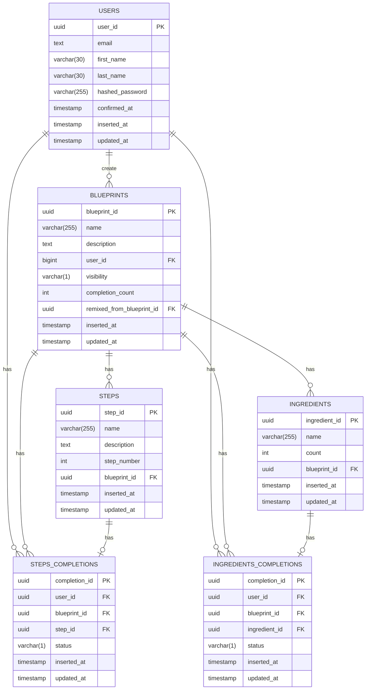

# Taskchecklist

## Motivation

I have to a lot of tasks where the task itself repeats and has a lot
of small hard to remember very important steps. I want to create this
tool to keep track of these hard to remember steps and things I need
to complete the tasks.

## Design

### ERD

To start your Phoenix server:

* Run `mix setup` to install and setup dependencies
* Start Phoenix endpoint with `mix phx.server` or inside IEx with `iex -S mix phx.server`

Now you can visit [`localhost:4000`](http://localhost:4000) from your browser
